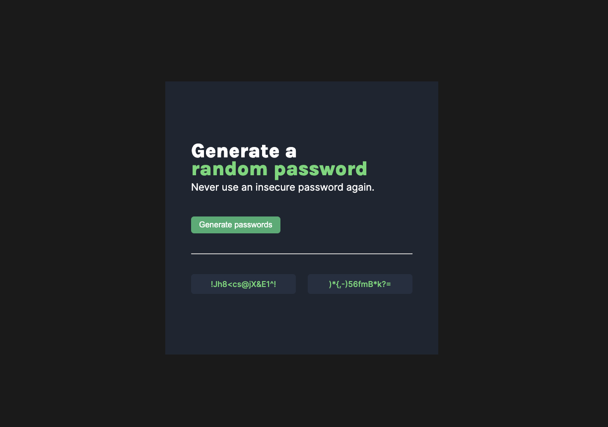

# Scrimba - SoloProject PassWord Generator

This is a solution to the [Time tracking dashboard challenge on Frontend Mentor](https://www.frontendmentor.io/challenges/time-tracking-dashboard-UIQ7167Jw). Frontend Mentor challenges help you improve your coding skills by building realistic projects.

## Table of contents

- [Overview](#overview)
  - [Screenshot](#screenshot)
  - [Links](#links)
- [My process](#my-process)
  - [What I learned](#what-i-learned)
  - [Stretch Goals](#stretch-goals)
  - [Useful resources](#useful-resources)
- [Author](#author)

**Note: Delete this note and update the table of contents based on what sections you keep.**

## Overview

### Screenshot



### Links

- Solution URL: [GitHub](https://github.com/graficdoctor/soloproject-password-generator)
- Live Site URL: [Netlify](https://superb-trifle-a88c8f.netlify.app/)

## My process

### What I learned

After last week learning about this, I encountered here my first use case for 'this'. I'd written the code copyToClipboard for each field seperately and didn't immediately know how to make the code mode DRY.

```js
fieldOne.addEventListener('click', (e) => {
	e.preventDefault();
	navigator.clipboard.writeText(fieldOne.textContent);
	console.log(fieldOne.textContent);
});

fieldTwo.addEventListener('click', (e) => {
	e.preventDefault();
	navigator.clipboard.writeText(fieldTwo.textContent);
	console.log(fieldTwo.textContent);
});
```

I turned to [Debug Code](debugcode.ai) from [Codedamn](https://codedamn.com/), and it suggested me this code.

```js
function copyToClipboard(e) {
	e.preventDefault();
	navigator.clipboard.writeText(this.textContent);
	// console.log(this.textContent);
}
```

### Stretch Goals

→ light color scheme + switch
→ ability to set password length
~~→ add ‘copy-on-click~~
→ Toggle ‘symbols’ and ‘nummers’ on-off

### Useful resources

- [Centering in CSS Grid](https://stackoverflow.com/questions/45536537/centering-in-css-grid) - Every time I use grid this question pops up. Centering inside CSS Grid always gets me confused. This Stackoverflow-page is a keeper.
- [Interact With The ClipBoard](https://developer.mozilla.org/en-US/docs/Mozilla/Add-ons/WebExtensions/Interact_with_the_clipboard) - I was following a tutorial on [Codedamn](https://codedamn.com/) on how to copy to clipboard. It showed me the deprecated method with `execCommand` but also the new method using the Clipboard API.

## Author

- Website - [Katrien S](https://www.katriens.be)
